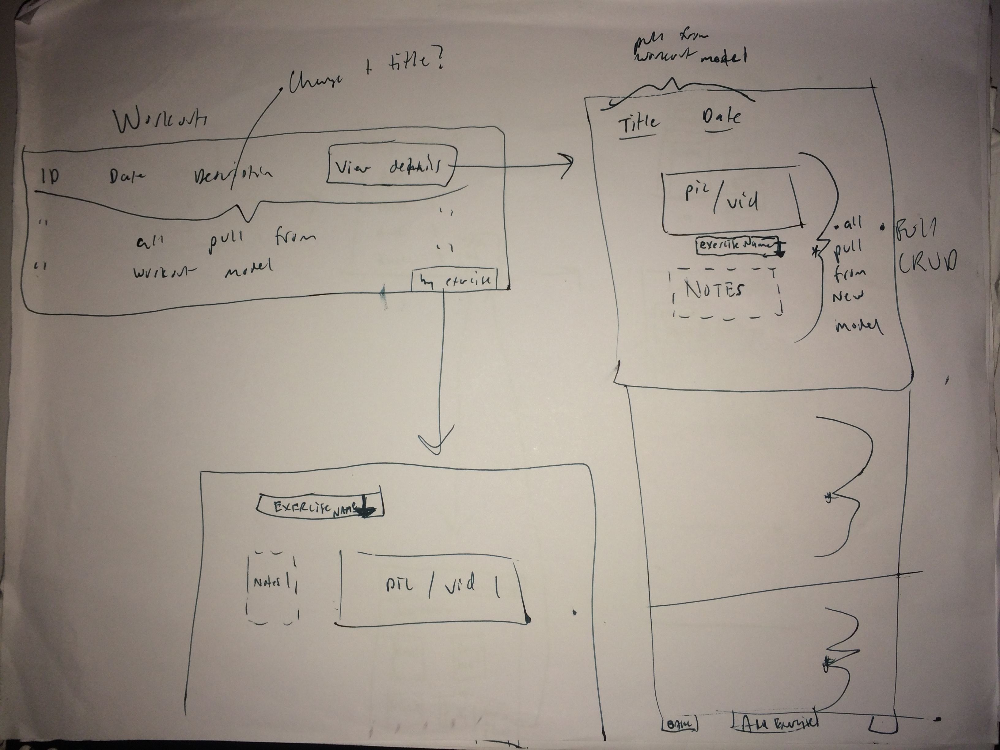
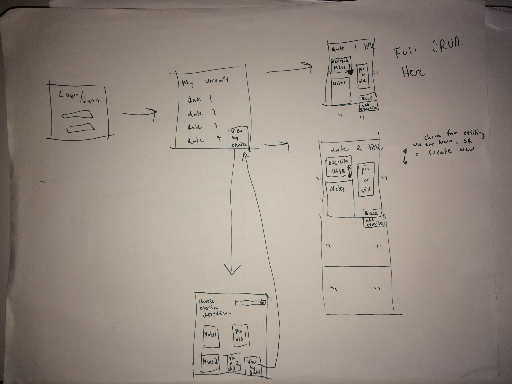
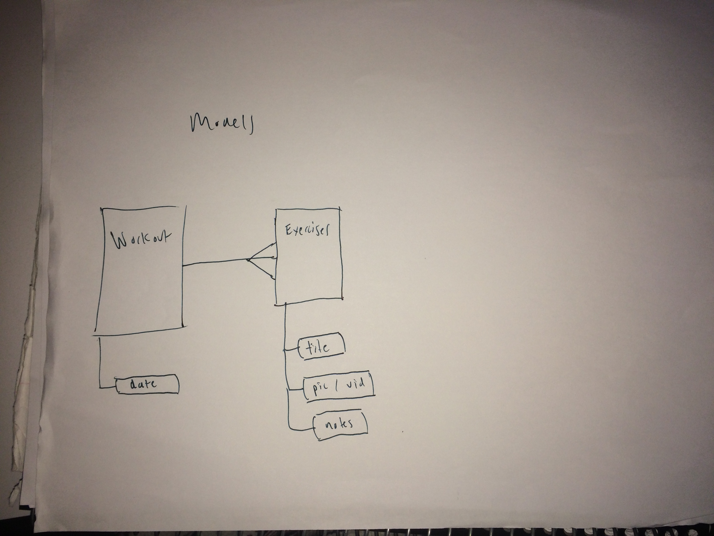

# Form Check App

##Technologies Used
For this application the primary technologies used were ruby, rails, hmtl, css, bootstrap, git, github, heroku, and gems 'carrierwave', 'carrierwave-video', 'b-crypt'.

##Approach Taken
I want my projects to have a purpose and solve a problem. Essentially be functional, rather than only meeting the requirements. I almost got there with this one. This idea is a simple one that could solve a problem for many fitness enthusiasts incluing myself. The idea is you can film your workouts and upload videos to the app. Next to the video you can leave comments critiquing your form. Over time you can watch your videos and improve on your form. You can view your workouts and the exercises contained, or just search the entire database of all exercises.

I did my best to take the simplest approach possible. I first drew out my wireframes so I could implement a planned structure rather than building on the fly. I first made workouts model which had many exercises. This made implementing users a bit hard because I had to insert the users model in fornt of workouts. I.e useres have many workouts have many exercises.

###First and Second draft of wire frames

###ERD

Once I reached this point, the main challenges were to implement the search feature, and video upload (addressed in unsolved problems)

##Installation Instructions

To use my app locally you must have PostgreSQL and a text editor like Sublime or Atom. 

1. Fork (aka download) my project here - https://github.com/AlexAnschuetz/real_ProjectTwo

2. Navigate to the folder real_ProjectTwo wherever you saved it, and open in your text editor.

3. In your terminal, run rake:db:create followed by rake:db:migrate

4. Activate PostgreSQL

5. In a new terminal tab run 'rails s'

6. In your web browser navigate to http://localhost:3000/login and have some fun!!

##Unsolved Problems
Unfortunately I was unable to succesfully get video uploads working. While I still meet the technical project requirements, the app essentially is pointless without videos. 

Additionally I was unable to complete the search function. The idea behind this function was that eventually users will have many workouts, each with many exercises. Eventually this will be cluttered and it may be hard to find a specific exercise. If users could search by exercise name or workout name, it could expedite this process.

Futhermore, right now exercise names are custom typed strings. I wanted to store these in a drop down so that if the user creates and exercise "Bench Press", when they upload another instance of them bench pressing they can just select "Bench Press" from the drop down. Without this feature users may forget their exact syntax and first enter "Bench Press" and then "bench-press" or "benchPress"... This will cause problems because the search by exercise function looks for an exact match in exercise name. With the dropdown menu, it would eliminate user error in creating exercise name. In other words it would assist the user to keep the same exercises under the same exercise name.